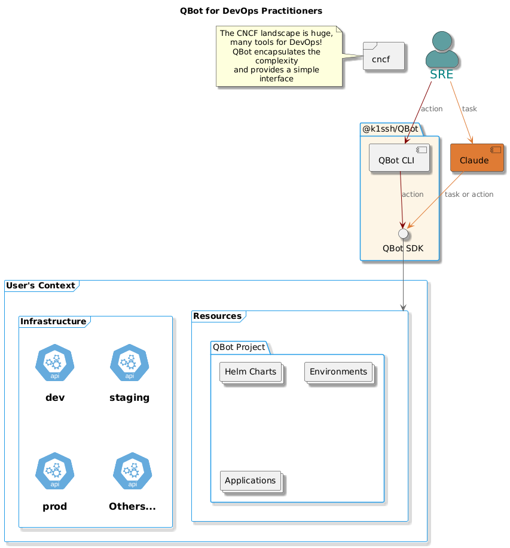

# QBot Concepts

- `tasks`: A task is a request sent to QBot, instructing it to perform an action. For example, you can ask QBot to deploy a new application, scale an existing application, or troubleshoot an issue. QBot interprets the request, determines the necessary steps, and executes the required actions.
- `resources`: Resources are the Kubernetes objects that QBot can manage, such as `Deployments`, `Services`, `ConfigMaps`, and more. These are the building blocks of your Kubernetes environment.
- `applications`: Applications are a subset of resources that represent deployable workloads. QBot can manage applications using Helm Charts, Kustomize, and other Kubernetes deployment strategies.
- `tools`: [Tools](https://agentico.dev/tools) are the AI-powered components that QBot leverages to execute `tasks`. They act as an interface between QBot and external systems such as LLMs (Large Language Models), Kubernetes API, Helm, and Kustomize.
  * Example: If you request QBot to deploy an application, it will determine the best approach and use the appropriate tool (e.g., `helm` for Helm Charts or `kustomize` for Kustomize applications).
  * Tools simplify complex DevOps tasks by managing the logic required to interact with applications and resources efficiently.

QBot can combine multiple tools to process a single task, ensuring flexibility and automation in Kubernetes operations.

### Components Overview Diagram

To start using QBot, you need to understand the components and how they interact with each other. The diagram below shows the main components of the QBot SDK and how they interact with each other.

To interact with the QBot SDK you can either use the [**QBot CLI**](./qbclt-cli/) or the [**QBot AI Agent**](./agentic-ai/). The QBot CLI is a command-line interface that allows DevOps practitioners to interact with Kubernetes applications using the QBot SDK in a granular way. The CLI provides a set of commands to interact with the QBot SDK, more details on how to install and use the CLI can be found in the [QBot CLI documentation](./qbclt-cli/).

The QBot AI Agent is a service that leverages Large Language Models (LLMs) to perform actions on the Kubernetes cluster intelligently. You can use any [MCP client](https://modelcontextprotocol.io/clients) to interact with the QBot AI Agent, for simplicity we recommend using [Claude for Desktop](https://claude.ai/download), but there are several [other MCP clients available](https://modelcontextprotocol.io/clients#feature-support-matrix) that supports the integration with [MCP Tools](https://modelcontextprotocol.io/docs/concepts/tools).

